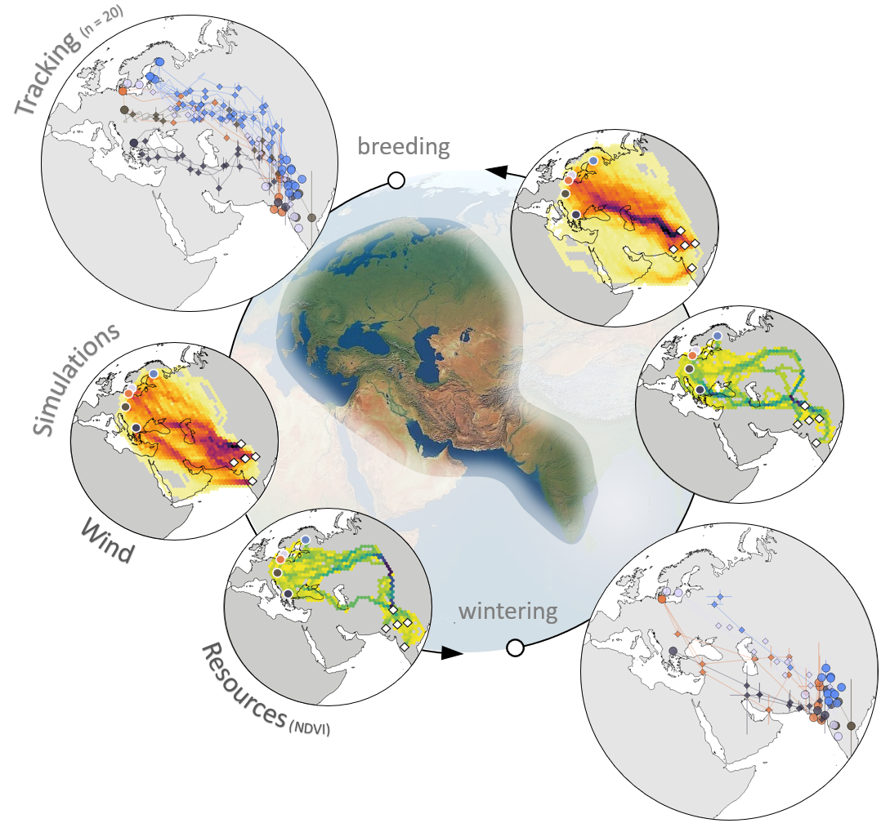

--- 
title: "Migration ecology of the Indo-European flyway - a case study on Common Rosefinch"
date: "Last edited on 2019-08-20"
site: bookdown::bookdown_site
output: bookdown::gitbook
documentclass: book
fontsize: 10
bibliography: [book.bib, packages.bib, journal.bib]
biblio-style: apalike
link-citations: yes
github-repo: slisovski/IndoEuropeanFlyway_Rosefinch
description: "Rosefinch migration - supplementary online material"
---

# Preface {-}

This is an online supplement to the Poster presented at the 2019 EOU conference in Cluj-Napoca, and provides detailed description of methods as well as additional data to review.

